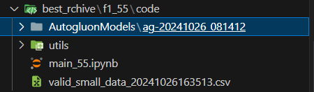

# ensemble-learning

## requirements

- [Installing AutoGluon - AutoGluon 1.1.1 documentation](https://auto.gluon.ai/stable/install.html)
- scikit-learn
- imbalanced-learn

## data

```shell
mkdir ./public_data
mkdir ./self_data
```

Put the data from `self_data.7z` into `./self_data`

`./self_data/processed` used to cache processed data. After augmenting data and train-test spliting, the processed data will be saved in this folder. If you want to re-augment data, you must delete this folder and rerun your code.

Where to get data for `best_archive`:

In `self_data/processed_<f1>` folder, you can find the processed data for the now best model. You can use this data to reproduce the best model.

## use

`ALL`: `ALL=True` means use all labeled data to train model. `ALL=False` means use part of labeled data to train model, and the rest of labeled data is used to test model.

`NO_SMOTE`: `NO_SMOTE=False` means use SMOTE to balance data.

`TEST_RAITO`: `TEST_RAITO=0.2` means 20% original labeled data is used to test model.

Feature selection is also very important. After reviewing the feature importance, you can remove some features that are not important to retrain the model in order to improve the model's performance.

`presets` in autogluon `TabularPredictor`: [autogluon-docs:presets](https://auto.gluon.ai/stable/tutorials/tabular/tabular-essentials.html#presets). This is important for the model to achieve better performance.

What not supported but you can do manually:

`Recursive Feature Elimination` (RFE) is a feature selection method. This is not supported, but you can use it manually to select features, `TabularPredictor` offer you the feature importance.

## dev

- In the `./code` folder:

Store `*.ipynb` (Jupyter Notebook) files without cell outputs.

- In the `./best_archive` folder:

1. Store `*.ipynb` files with cell outputs to save the execution record of the best model.
2. Store the best model in the `AutogluonModels` directory. (Don't push, gitignore it)
3. Store the best model's predictions in `*.csv` files.
4. Copy all code files from the code folder.

example:

